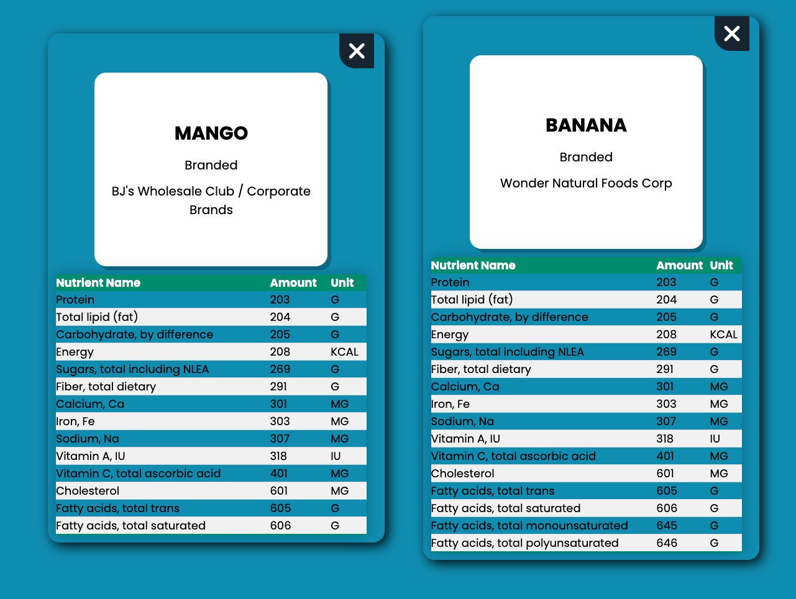
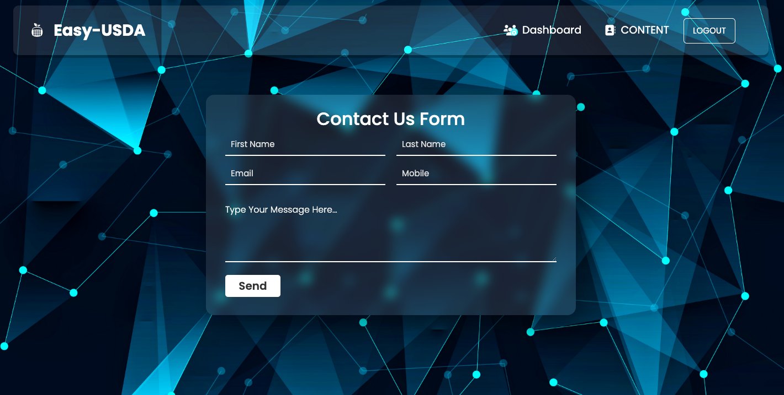

# EASY-USDA

## Table of Contents

- [EASY-USDA](#easy-usda)
  - [Table of Contents](#table-of-contents)
  - [Description](#description)
  - [Usage](#usage)
  - [Contribution](#contribution)
  - [Credits](#credits)
  - [Link](#link)
  - [Demonstration](#demonstration)

## Description

Currently, anyone can Google a specific ingredient or product, but the search results are general and vast. This can mislead users to sites that are at the top of a search, but do not provide reliable information aka misinformation. This app allows users to query the official USDA API for information on a given food and/or ingredient to a food. This app will be available to the general public but can help several specific demographics such as new/expecting parents looking to verify the safety of ingredients in food they are giving their infant. This app will benefit several groups that have the common goal of furthering their knowledge of the food items they are ingesting or purchasing.

This is a full-stack MERN application using the following technologies:

- React for the front end.
- GraphQL with a Node.js and Express.js server.
- MongoDB and the Mongoose ODM for the database.
- JWT for authentication.
- Heroku.
- Third-party front-end libraries, including emailjs, sweetalert2, animate.css.

## Usage

The user can

- sign up for their profile;
- log in and log out;
- query USDA API for information on a given food and/or ingredient;
- save the queried information, view them and delete them.

## Contribution

If you have an idea to improve this app, fork the repo, create your branch, commit changes, push your contribution to your branch, and create a pull request.

## Credits

- Francisco Sanchez: MXCAZ
- Ang Lee: annielawang
- Heidrun Kubiessa: Kubikubiessa
- Roldan Navarrete: roldanmoncada

## Link

[Go to EASY-USDA](https://easy-usda.herokuapp.com/dashboard)

## Demonstration

Main page is the login screen. If a user doesn't have an account, they can click on either sign up links to be redirected to that page.

At the signup page, users are asked to input 3 fields of information that will pertain to their new EASY-USDA account.

Upon creating a valid new account, users are redirected to their dashboard. Here they can access numerous features of the site.

Screen for querying a food or ingredient

Entries of food information from USDA API saved by the user

ABOUT page describing the EASY-USDA web application

CONTACT allowing the user to leave a message and their contact information. Then an reply email will be sent to the user automatically saying their message has been received and will be reviewed.

When a user signs out, they will be redirected to the login screen where they can choose to log back in!

Thank you for using EASY-USDA!
